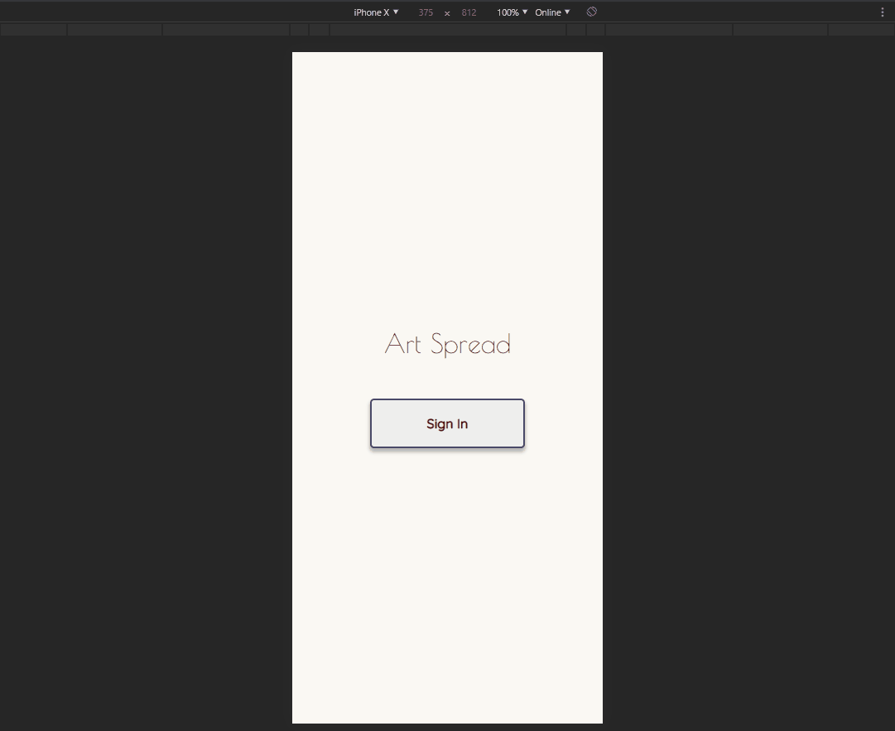

# ART SPREAD

#### A webapp for artists looking to consistently upload to all social media platforms

## Project Goals
* Simultaneous photo uploading
* Convenient account management
* Simple, friendly UI/UX

## Technologies Used
* React.js
* Webpack 4
* Bootstrap 4
* Node.js
* PostgreSQL
* HTML5
* CSS3
* AWS EC2

## Live Demo
Try the application live at https://art-spread.jwenning.digital/

## Features
* User can 'log in'
* User can log out
* User can create profiles
* User can delete profiles
* User can link social media (reddit) accounts to art spread
* User can unlink social media (reddit) accounts from artspread
* User can link social media (reddit) accounts to current profile
* User can unlink social media (reddit) accounts from current profile
* User can create posts
* User can delete posts with associated publications
* User can publish posts to linked accounts
* User can view publication analytics
* User can view publication comments
* User can like publication comments
* User can unlike publication comments
* User can reply to publication comments

## Preview

## Development
### System Requirements
* Node.js 10 or higher
* NPM 6 or higher
* Postgres 10 or higher

### Getting Started
1. Clone the repository.

`git clone https://github.com/j-wenning/art-spread`

`cd art-spread`

2. Install all dependencies with NPM.

`npm install`

3. Import the example database to PostgreSQL.

`npm run db:import`

4. Start the project. Once started you can view the application by opening http://localhost:3000 in your browser.

`npm run dev`

### Additional Notes
* Publications can be found here: https://www.reddit.com/r/testingground4bots/
* Measures are in place for keeping the majority of the app accessible despite external API rate limits, in most scenarios you will only be required to wait for approximately 1 minute before features make themselves available again
* Posting a comment will leave the Reddit API (and all features involving it) unaccessible for 10 minutes, leave that for last!
